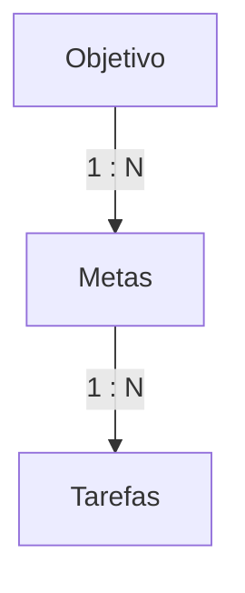

# Plano de Banco de Dados e Fluxo: Objetivos, Metas e Tarefas

Este documento organiza toda a hierarquia, as regras de negócio, os fluxos do frontend e as estruturas relacionais (tabelas e campos do Supabase PostgreSQL) para o módulo unificado de **Objetivos, Metas e Tarefas**, excluindo as seções obsoletas e consolidando a nova estrutura de execução.

---

## ─── 1. HIERARQUIA E FLUXO DO SISTEMA ───

A arquitetura do banco segue uma relação hierárquica clara de um para muitos (1:N):


### O que foi removido do fluxo e do app para simplificação:
*   **Do Fluxo de Objetivos**: 
    *   Botão e container "+ Sintonizar Dimensão".
    *   Sessão de "Objetivos Relacionados & Dependências".
*   **Do Fluxo de Metas**:
    *   Seleção de "Contexto da Experiência".
    *   Inserção manual de "Quais ações? (+ Adicionar Ações)".
    *   Configuração do "Ritmo de Execução" das ações da meta.
*   **Do Fluxo de Tarefas**:
    *   Seção 7 (Engine de KPIs) e Seção 8 (Preview) do Modal de Criação de Tarefas.

---

## ─── 2. DETALHAMENTO DE INPUTS POR ETAPA ───

### A. Fluxo de Criação de Objetivo (5 Fases)

*   **Fase 1**:
    1. **O que você deseja exatamente (Nome)** -> `title` (input texto)
    2. **Declaração de desejo ardente** -> `burning_desire` (textarea)
    3. **A sensação de conquista** -> `feeling_of_achievement` (textarea)
    4. **Prioridade** -> `priority` (Múltipla escolha: Baixa, Média, Alta, Desejo Ardente)
    5. **Status da manifestação** -> `manifestation_status` (Múltipla escolha: Concepção, Em manifestação, Em pausa, Materializado, Arquivado)
*   **Fase 2**:
    1. **Sacrifício** -> `sacrifice` (textarea)
    2. **Plano de ação** -> `action_plan` (textarea)
    3. **Data limite** -> `start_date` vs `deadline` (campos de data/time)
    4. **Recorrência mental** -> `mental_recurrence` (booleano/botão de ativar)
*   **Fase 3**:
    1. **Imagens de manifestação** -> `manifestation_images` (Upload da galeria/links de fotos)
    2. **Vídeos Motivacionais** -> `motivational_videos` (Upload/links)
*   **Fase 4**:
    1. **Contexto geral de evolução (Propósito humano)** -> `evolutionary_context` (textarea)
*   **Fase 5**:
    1. **Matriz de riscos** -> `risks` (Lista com descrição do risco, probabilidade 1-5, impacto 1-5, plano de mitigação)

---

### B. Fluxo de Criação de Meta
1. **Intenção (Nome da Meta)** -> `intention` (input) + descrição completa -> `description` (textarea)
2. **Significado** -> `meaning` (textarea)
3. **Evolução esperada** -> `expected_evolution` (textarea grande)
4. **Tempo** -> `deadline` (quando precisa acontecer)
5. **Consequência e Risco**:
    *   Se não for executado, o que acontece? -> `consequence` (textarea)
    *   Quais riscos podem impedir? -> `risks` (textarea)
    *   Impacto de não cumprimento -> `impact_level` (Múltipla escolha: Baixo, Médio, Alto, Crítico)
6. **Estratégia** -> `strategy` (Como isso vai acontecer? - textarea grande)
7. **Identidade** -> `color` (Escolha entre 5 cores pré-definidas)

---

### C. Fluxo de Tarefas (Estrutura Unificada de Execução)
Consolida em uma única tabela todos os metadados de execução física (áudio, escrita, finanças, bioenergética) para permitir flexibilidade de execução sem tabelas separadas por tipo.

---

## ─── 3. SCHEMAS SQL PARA SUPABASE (POSTGRESQL) ───

Abaixo estão as tabelas ordenadas de maneira correta para execução imediata no painel SQL do seu Supabase Self-Hosted.

```sql
-- 1. TABELA DE OBJETIVOS
CREATE TABLE objectives (
  id UUID PRIMARY KEY DEFAULT gen_random_uuid(),
  title TEXT NOT NULL,
  burning_desire TEXT NOT NULL,
  feeling_of_achievement TEXT NOT NULL,
  priority TEXT NOT NULL DEFAULT 'medium',
  manifestation_status TEXT NOT NULL DEFAULT 'conception',
  sacrifice TEXT NOT NULL,
  action_plan TEXT NOT NULL,
  start_date TIMESTAMPTZ NOT NULL DEFAULT NOW(),
  deadline TIMESTAMPTZ NOT NULL,
  mental_recurrence BOOLEAN DEFAULT FALSE,
  manifestation_images TEXT[] DEFAULT '{}',
  motivational_videos TEXT[] DEFAULT '{}',
  evolutionary_context TEXT NOT NULL,
  risks JSONB DEFAULT '[]'::jsonb,
  created_at TIMESTAMPTZ DEFAULT NOW(),
  updated_at TIMESTAMPTZ DEFAULT NOW()
);

-- 2. TABELA DE METAS (Forte ligação com Objetivos)
CREATE TABLE goals (
  id UUID PRIMARY KEY DEFAULT gen_random_uuid(),
  objective_id UUID NOT NULL REFERENCES objectives(id) ON DELETE CASCADE,
  intention TEXT NOT NULL,
  description TEXT,
  meaning TEXT NOT NULL,
  expected_evolution TEXT NOT NULL,
  deadline TIMESTAMPTZ NOT NULL,
  consequence TEXT NOT NULL,
  risks TEXT NOT NULL,
  impact_level TEXT NOT NULL DEFAULT 'medium',
  strategy TEXT NOT NULL,
  color TEXT NOT NULL DEFAULT '#c3b1e1',
  created_at TIMESTAMPTZ DEFAULT NOW(),
  updated_at TIMESTAMPTZ DEFAULT NOW()
);

-- 3. TABELA DE TAREFAS (Forte ligação com Metas)
CREATE TABLE tasks (
  -- Identidade da Tarefa
  id UUID PRIMARY KEY DEFAULT gen_random_uuid(),
  goal_id UUID NOT NULL REFERENCES goals(id) ON DELETE CASCADE,
  title TEXT NOT NULL,
  execution_type TEXT NOT NULL DEFAULT 'standard',
  description TEXT,
  visual_anchor_url TEXT,
  status TEXT DEFAULT 'todo',
  
  -- Estrutura Executável
  complexity TEXT DEFAULT 'low',
  subtasks JSONB DEFAULT '[]'::jsonb,

  -- Tempo e Agenda
  scheduled_date TIMESTAMPTZ,
  estimated_duration TEXT DEFAULT '',
  actual_duration INTEGER DEFAULT 0,
  is_recurring BOOLEAN DEFAULT FALSE,
  recurrence_pattern TEXT,
  recurrence_days TEXT[] DEFAULT '{}',
  parent_recurrence_id UUID,

  -- Impacto e Prioridade
  priority TEXT DEFAULT 'medium',
  strategic_impact TEXT DEFAULT 'medium',

  -- Execução Parapsíquica / Bioenergética ('energy-work')
  energy_volume INTEGER DEFAULT 0,
  sync_modality INTEGER DEFAULT 0,
  hyperlucidity INTEGER DEFAULT 0,
  technique TEXT,
  sensations TEXT[] DEFAULT '{}',
  phenomena TEXT[] DEFAULT '{}',
  self_research_notes TEXT,

  -- Vinculação de Notas
  linked_document_ids UUID[] DEFAULT '{}',

  -- Detalhes Multimodais (Áudio, PDF e Finanças)
  audio_url TEXT,
  audio_duration INTEGER DEFAULT 0,
  audio_notes TEXT,
  
  document_url TEXT,
  written_content TEXT,
  word_count INTEGER DEFAULT 0,

  transaction_value NUMERIC(12, 2) DEFAULT 0.00,
  transaction_type TEXT,
  financial_category_id UUID,
  receipt_url TEXT,

  -- Controles de Sistema
  completed_at TIMESTAMPTZ,
  created_at TIMESTAMPTZ DEFAULT NOW(),
  updated_at TIMESTAMPTZ DEFAULT NOW()
);
