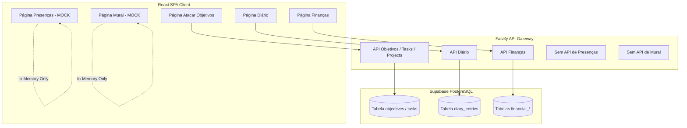

# Plano Estratégico de Integração e Modelagem de Dados

Este plano mapeia a arquitetura de dados atual do sistema, identificando o que está integrado ao banco de dados Supabase (PostgreSQL) e o que está funcionando temporariamente em memória (mock de dados), fornecendo um cronograma macro e detalhado por página para estabilização total do ecossistema.

---

## ─── 1. ARQUITETURA ATUAL E DIAGNÓSTICO (ESTADO MACRO) ───



### Resumo do Status de Integração:
| Página / Módulo | Status do Banco | Localização do Serviço | Ação Necessária |
| :--- | :--- | :--- | :--- |
| **Atacar Objetivos** | 🟢 100% Integrado | `objectivesService.ts` | Pronto (Correções de FKs aplicadas). |
| **Diário** | 🟢 100% Integrado | `diaryService.ts` | Pronto. |
| **Finanças / Transações** | 🟢 100% Integrado | `financialService.ts` | Pronto. |
| **Presenças** | 🔴 In-Memory Mock | `presenceService.ts` | Criar tabela, API de CRUD e ligar front. |
| **Mural de Conquistas**| 🟡 Parcialmente em Lote | `muralService.ts` | Garantir gravação atômica por conquista. |
| **Cortes / Workspace** | 🟢 100% Integrado | `workspaceService.ts` | Pronto. |

---

## ─── 2. PLANO DETALHADO PÁGINA POR PÁGINA ───

### Fase 1: Correção do Módulo de Presenças
*   **Ação de Dados**: Criar migration `006_create_presences_table.sql` com:
    *   `id` (PK), `user_id` (FK), `name`, `photo`, `city`, `profession`, `dna`, `influencia`, `acionar_quando`, `peso` (0-10), e demais metadados complexos salvos como JSONB (ex: `connections`, `characteristics`).
*   **Ação de Backend**: Adicionar `backend/src/presenceRoutes.ts` implementando o CRUD completo para presenças.
*   **Ação de Frontend**: Alterar [presenceService.ts](file:///c:/Users/USUARIO/Desktop/ENTRADA%20SUCESSO/src/services/presenceService.ts) para realizar requisições HTTP reais.

### Fase 2: Auditoria de Outros Elementos em Memória (Mural / Configs)
*   **Mapeamento de Pontas Soltas**: Verificar se as conquistas ou fotos adicionadas no Mural do Sucesso estão de fato sendo salvas nas colunas do banco ou se estão presas em `localStorage`.
*   **Ajustes de Backup local**: Garantir que as configurações gerais e dados de perfil do usuário não se percam em novos computadores.

---

## ─── 3. ARQUITETURA PROPOSTA: VISUALIZADOR DE DADOS (CRM/MAPA) ───

Para atender ao seu desejo de ter uma tela interativa estilo um **CRM de Banco de Dados** dentro do próprio sistema, propomos construir a página **`DatabaseMapPage`** (ou Central de Dados):

### Interface de Visualização (CRM de Dados):
```
┌────────────────────────────────────────────────────────────────────────┐
│  CENTRAL DE COMANDO > CRM DE BANCO DE DADOS                            │
├────────────────────────────────────────────────────────────────────────┤
│ Selecione a Tela: [ Página Presenças ▼ ]                               │
│                                                                        │
│ TABELAS DETECTADAS:                                                   │
│ ┌─────────────────────────┐      ┌───────────────────────────────────┐ │
│ │ Tabela: presences       │      │ Estrutura da Tabela               │ │
│ ├─────────────────────────┤      ├───────────────────────────────────┤ │
│ │ 📇 id (text, PK)        │ ───> │ Tipo: PostgreSQL no Supabase      │ │
│ │ 👤 user_id (text)       │      │ Registros Ativos: 3 mentores      │ │
│ │ 🏷️ name (text)          │      │ Tamanho estimado: 12 KB           │ │
│ │ 🧠 dna (text)           │      │                                   │ │
│ │ ⚙️ metadata (jsonb)     │      │ [ Visualizar Linhas do Banco ]    │ │
│ └─────────────────────────┘      └───────────────────────────────────┘ │
└────────────────────────────────────────────────────────────────────────┘
```

### Funcionalidades do Visualizador:
1.  **Mapeador Página-Tabela**: Selecione qualquer página do seu app, e veja visualmente em formato de cards quais tabelas alimentam aquela tela.
2.  **Inspetor de Colunas e Tipagem**: Exibe quais tipos de dados estão sendo salvos (inteiros, strings, JSONs).
3.  **Status de Conexão em Tempo Real**: Indicador de que a tabela está respondendo perfeitamente no Supabase.
